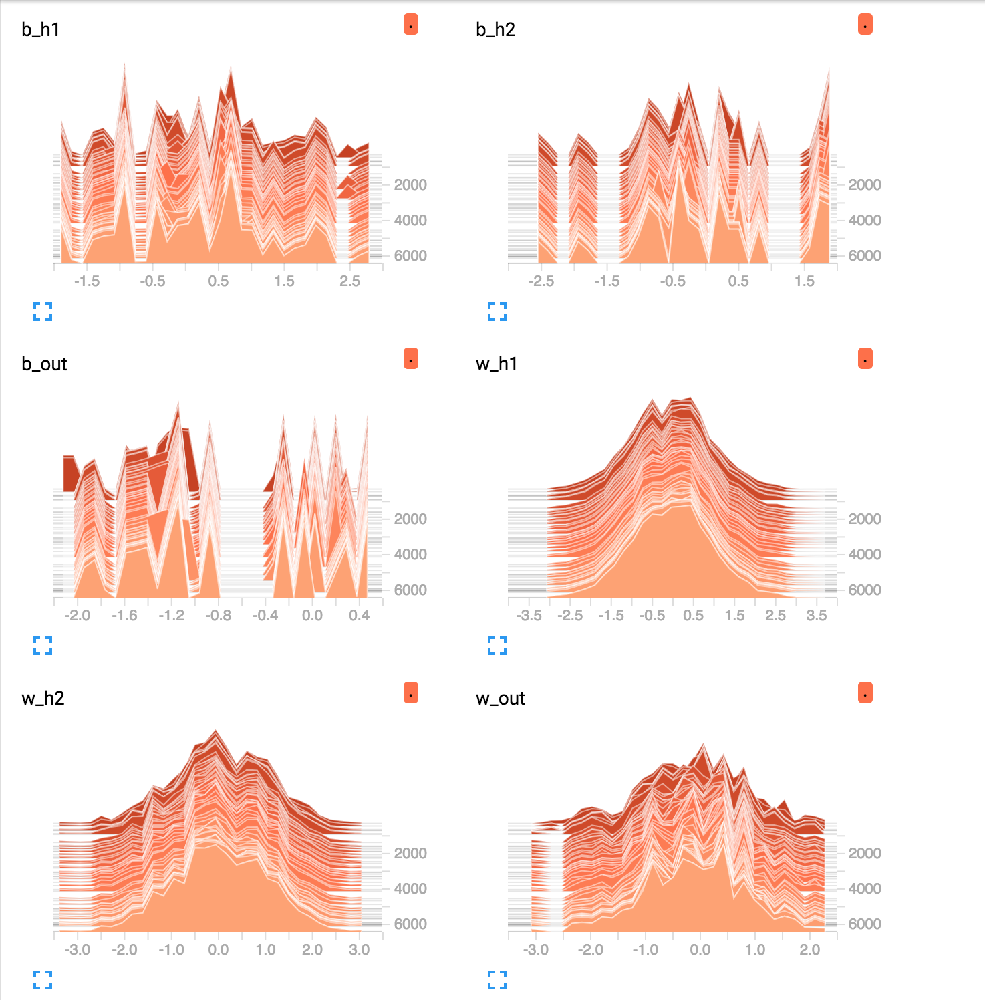
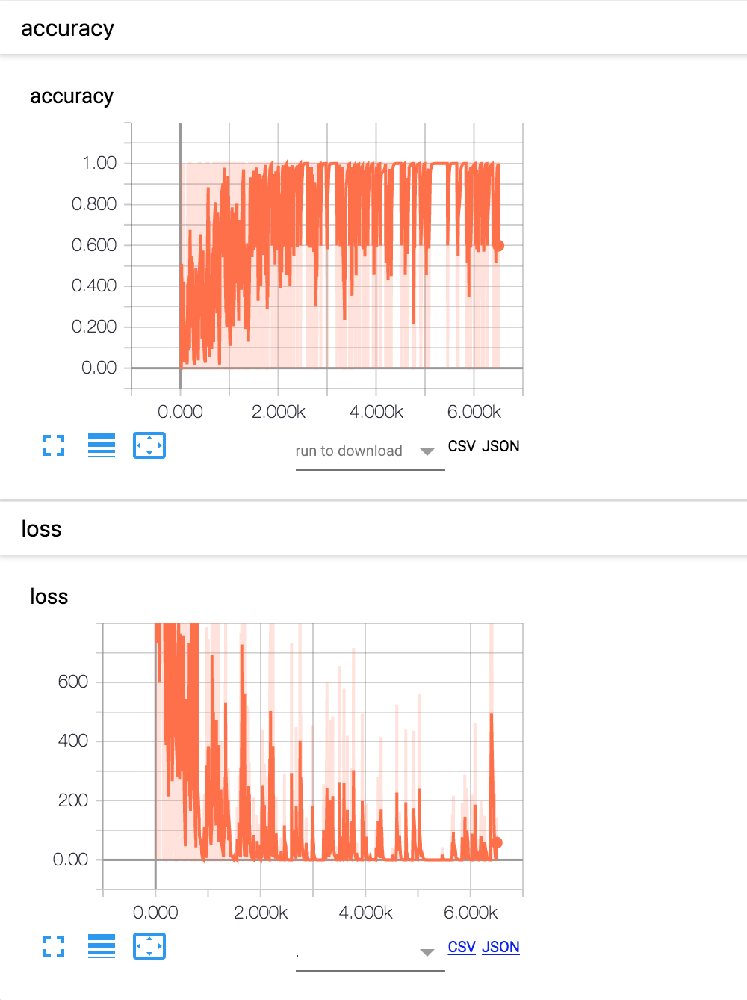

#Handwritten digits recognition using Neural Network with 2 Hidden Layers

Before running this code, make sure you install tensorflow and sklearn

<a href="https://www.tensorflow.org/install/">Install Tensor Flow</a>

<b>Note</b>

You can train this neural network on any custom dataset (either from csv files using pandas or any sklearn dataset)
<b>data_frame</b> will be your dataframe.
whatsover you have to adjust number of neurons (n_hidden_1, n_hidden_2) in hidden layers according to number of features and labels. 

Example :
input (n_features): 1000
n_hidden_1 : 700
n_hidden_2 : 300
output (n_classes): 100

Neural Network with 2 hidden layers taking input as handwritten dataset(15K*64) and mapping it to 10 classes
<ul>
  <li>Loss Function : Cross Entropy</li>
  <li>Optimizer of Loss Function : Adam Optimizer</li>
 <li> Neural Network Structure
   <ul>

    input: 64 ( number of features )
    n_hidden_1 : 40
    n_hidden_2 : 20
    output: 10 (number of classes)

   </ul>
   </li>
   
</ul>

<h4>Weights and Biases</h4>

<h4>Accuracy and Cost</h4>

To visualize flow, install tensorboard and run this script,then 

run '''tensorboard --logdir=tmp/mnist'''
